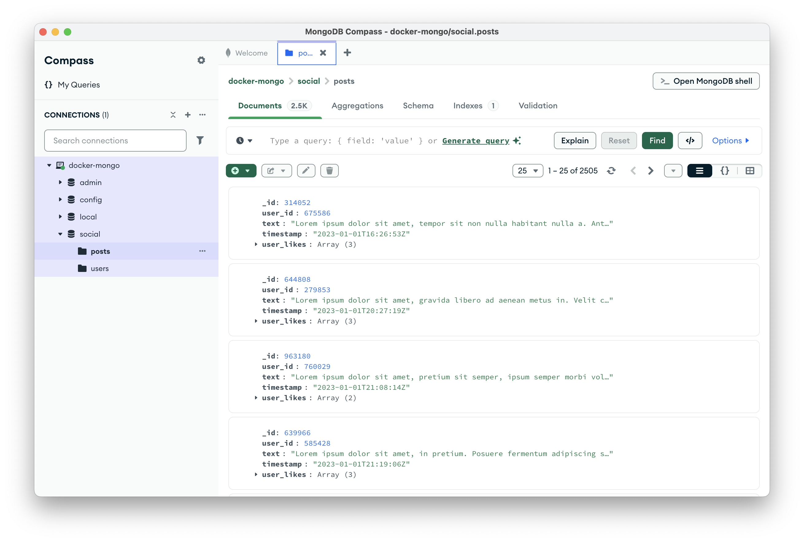
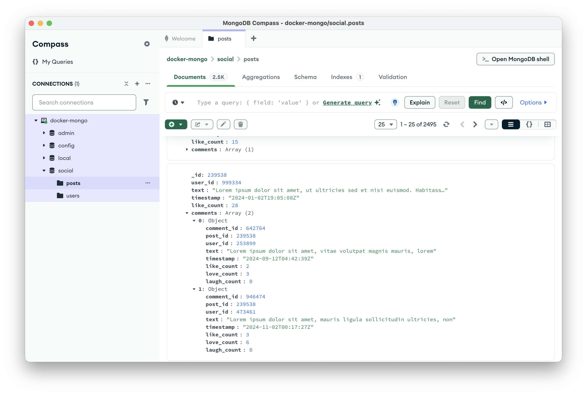
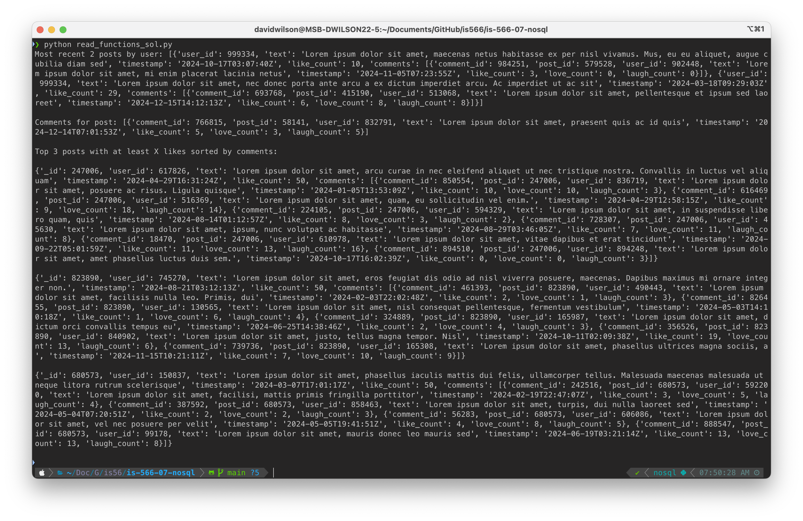
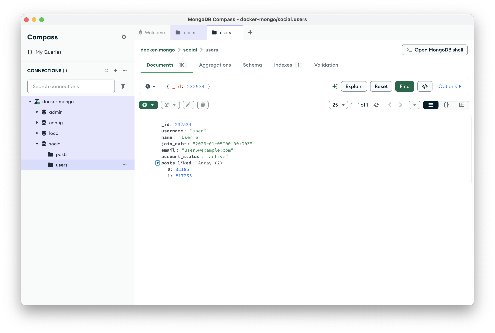
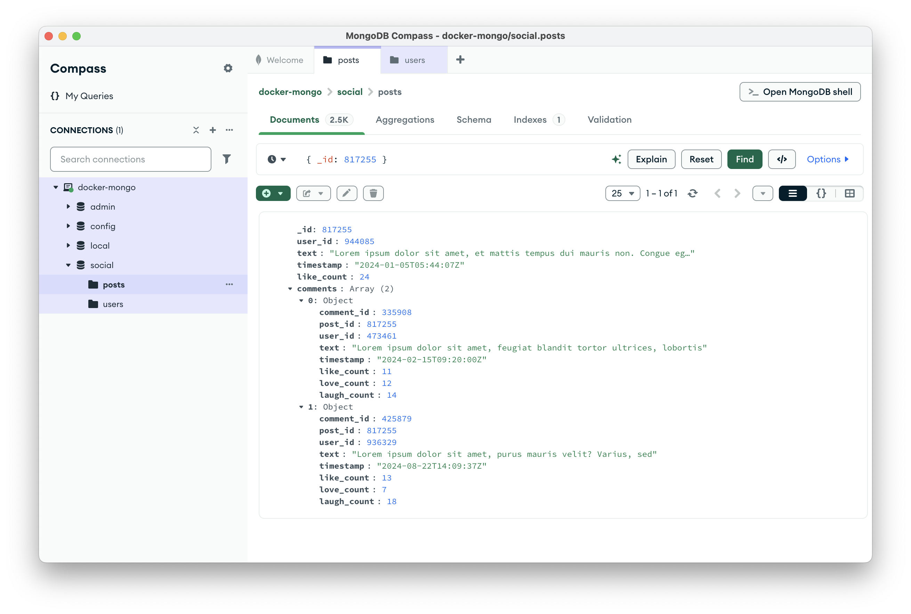
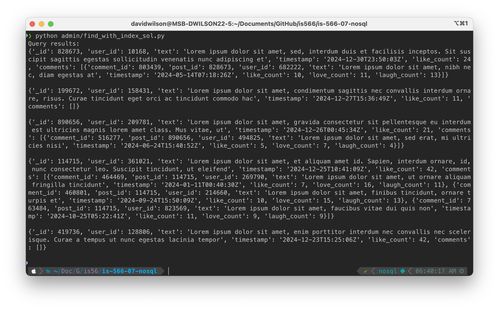
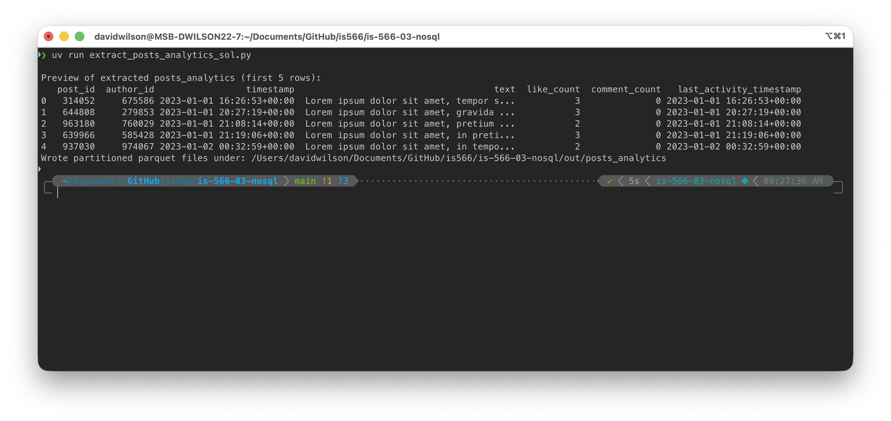
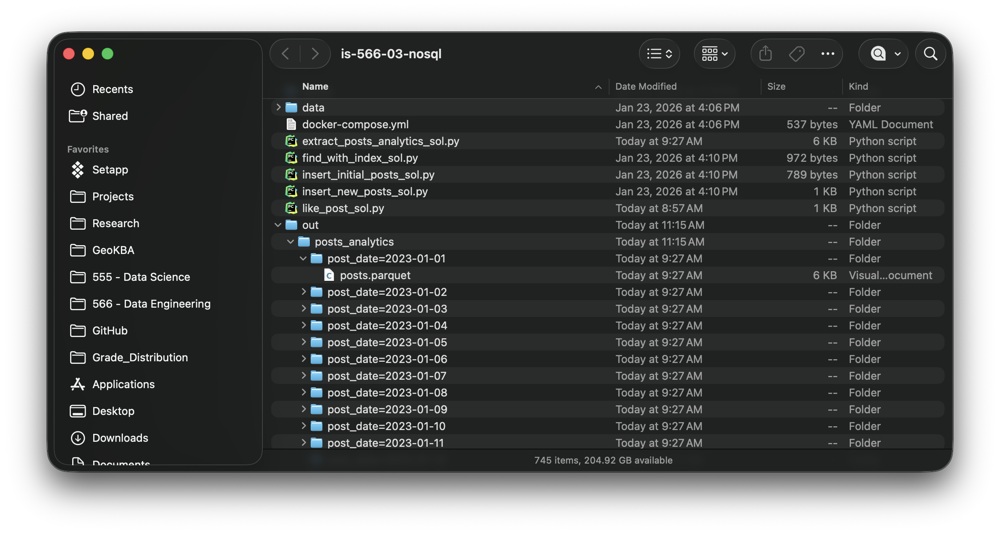

# Hands-On Lab: NoSQL Fun with MongoDB

In this lab, you’ll assume the role of a data engineer who works for a growing social media platform. Until now, the platform has relied on a traditional relational database to track users and their posts on the network, but that's not going to cut it for much longer. With new features in the works and a growing user base, the company has made the strategic decision to transition to a MongoDB data store for more flexible and scalable data workflows.

The company has exported its existing users and posts from the relational database, providing them to you as flat files in the `data/` folder:
- `users.json`: A JSON file containing all user records.
- `initial_posts.csv`: A CSV file containing all existing posts.

Your job is to migrate the data to MongoDB, modify the data structure to support new features, implement several data input, update, and retrieval tasks using PyMongo, and optimize performance using indexing.

---

## Before We Begin: Let's talk about AI Tools

For this assignment, you should assume that working collaboratively with generative AI tools is expected and encouraged. In practice, data engineers routinely use AI to help draft code, explore unfamiliar APIs, and iterate more quickly on implementation details. Learning how to use these tools effectively and responsiblyis therefore an explicit learning outcome of this course.

That said, using AI well is not the same as asking it to “do the assignment for you.” The goal is to use AI as a coding partner that helps you reason about data structures, translate requirements into code, and debug issues—not as a black box that produces solutions you don’t understand.

When working with AI tools, you will generally get the best results if you:
- Clearly describe the data structure you are working with (often by pasting a representative excerpt).
- Specify the task you want the code to perform.
- Indicate any constraints or libraries you are required to use (for example, `PyMongo`).

For example, suppose your MongoDB posts collection contains documents that look like the following:

```json
const sampleBook = {
    _id: new ObjectId("609d1b2f8a5b8b001b8b4567"),
    title: "The Art of Programming",
    author: "John Doe",
    published_year: 1995,
    genres: ["Technology", "Programming"],
    price: 39.99,
    stock: 12,
    is_available: true,
    rating: 4.7,
    published_date: new ISODate("1995-05-15T00:00:00Z")
};
```
A productive prompt to an AI tool might look something like:

> Given MongoDB documents with the structure shown above, write a Python function using PyMongo that retrieves all books in the Technology genre that are currently available (is_available = true) and have a rating greater than 4.5. The function should return the results sorted by published_date, from most recent to oldest.

You are welcome—and encouraged—to use AI tools in this way throughout the assignment. Just remember that you are responsible for understanding, testing, and adapting the code you submit, and for ensuring that it satisfies the specific requirements described in each task.

# Part A: Working with MongoDB as a Transactional Database (Software Engineer Hat)

In the first part of this lab, you’ll work from the perspective of a software engineer building an application backed by MongoDB. Your focus will be on modeling data, supporting evolving application features, and implementing the kinds of insert, update, and query operations that support user-facing functionality. This work emphasizes flexibility, responsiveness to change, and efficient access patterns that demonstrate MongoDB’s role as a transactional database in modern systems.

Later in the lab, you’ll switch roles and approach this same database from a different perspective. In Part B, you’ll step into the role of a data engineer and treat MongoDB as an operational _source_ system, extracting and publishing data for downstream analytics. For now, your goal is to design and interact with MongoDB in a way that reflects how application teams typically use it in practice.

---

## Task 1: Initialize the Database with Initial Users and Posts

Your first task is to set up a MongoDB database and populate it with the initial user and post data. Spin up MongoDB using the provided Docker compose configuration, create a new database called `social`, and import `users.json` manually using MongoDB Compass.

Next, you'll need to write a Python script (called `insert_initial_posts.py`) that reads in the `initial_posts.csv`, does some light processing, and inserts the posts into a new `posts` collection. As you do this, you'll need to:
  - Ensure that each post's `post_id` is used as the `_id` field in MongoDB to prevent auto-generated ObjectIds.
  - Pay attention to the `likes` column (which contains a pipe-separated list of one or more user IDs), which needs to end up as an array of user IDs called `user_likes` in the post documents you insert.

When you've got this working properly, you should be able to verify that the documents landed using MongoDB Compass. You should be able to see about 2500 documents in the `posts` collection, similar to the screenshot below.



> [!IMPORTANT]
> 📷 Before continuing on, take a screenshot of your own Compass window similar to mine above. Save this screenshot as `task_1.png` (or jpg) to the `screenshots` folder in the assignment repository.

---

## Task 2: Add New Posts with Updated Format and Comments

With the initial data migrated, it’s time to take advantage of our new flexible data structure. The platform has made a change to the way that it tracks likes on posts (changing to a simple count of likes rather than tracking which specific users liked a given post). These changes are reflected in the data stored in the `new_posts.csv` file. It has also added support for comments. Both of these changes would create problems (or at least some extra work) when data was stored in the relational database, but the MongoDB implementation has no qualms whatsoever.

So your next task is to write a new script (`insert_new_posts.py`) to process `new_posts.csv` and insert them into the database. Unlike in `initial_posts.csv`, the `likes` column in `new_posts.csv` now stores a numeric "like count" instead of an array of user IDs. You'll need to handle this differently in the python logic, ultimately ensuring that the count values are stored in a `like_count` field in the `posts` collection. 

You'll also need to embed the comments found in `comments.csv` as a `comments` array within each corresponding post document. (This will entail a grouping operation in the pandas dataframe before converting to json/dict format.) 

When you've got it working correctly, you should now have about 5000 documents in the `posts` collection. In order to see that the new posts are formatted correctly, including embedded comments, you'll need to run a query that filters your displayed results to documents where the `like_count` field exists. This should produce a set of around 2500 post documents, and if you scroll a bit to find a post with `_id=239538` and then expand the comments array, you'll see something similar to my screenshot below.



> [!IMPORTANT]
> 📷 Before continuing on, take a screenshot of your own Compass window similar to mine above. Save this screenshot as `task_2.png` (or jpg) to the `screenshots` folder in the assignment repository.

---

## Task 3: Querying the Database

Now that the database is structured properly, let's build a few functions that represent potential real-world query use cases. These will all be contained within a single script (called `read_functions.py`) that contains the following functions:
  - `find_recent_posts_by_user(user_id)`: Retrieves the two most recent posts made by a user, given a user_id.
  - `get_comments_for_post(post_id)`: Fetches all comments for a given post.
  - `get_posts_with_min_likes(min_likes)`: Finds posts with at least `min_likes`, but only returns the top three posts that have the most comments.

The script should have a `main` function that calls each of the three functions with some sample parameters. You can just paste in the code block below so that you can compare your output to what you see in my screenshot.

```python
if __name__ == "__main__":
    user_id = 999334
    post_id = 58141
    min_likes = 49
    
    print("Most recent 2 posts by user:", find_recent_posts_by_user(user_id), "\n")
    print("Comments for post:", get_comments_for_post(post_id), "\n")
    print("Top 3 posts with at least X likes sorted by comments:\n")
    for post in get_posts_with_min_likes(min_likes):
        print(post, "\n") 
```

Running the main function above should produce output similar to the screenshot below.



> [!IMPORTANT]
> 📷 Before continuing on, take a screenshot of your own terminal window similar to mine above. Save this screenshot as `task_3.png` (or jpg) to the `screenshots` folder in the assignment repository.

---

## Task 4: Implement the "Like" Functionality

As the platform evolves its user engagement strategy, it has changed the way it accounts for users liking another post. Let's implement support for this new post liking method by adding another script (called `like_post.py`) that (a) increments the `like_count` value for a given post, and (b) logs a given user's liking behavior in the user document with a new `posts_liked` array that contains the post ids of liked posts. Additionally, the script should ensure that a user cannot like the same post more than once; if a user likes a post a second time, the function will simply ignore the action so that the engagement statistics in the database do not get inflated. 

As you build out this functionality, you should test your script's functionality with users and posts that are different from those included in the test procedure below. (This will help prevent the need to reset the database by re-running the data import steps from prior tasks; I'm just trying to save you time here.)

Once you have a function working as intended, demonstrate its functionality by running the function several times, using the following test values:
  - `user_id = 232534`, `post_id = 32185`
  - `user_id = 232534`, `post_id = 817255`
  - `user_id = 232534`, `post_id = 817255`

If you run queries to verify the actions above, you should see results that match those shown in the screenshots below.





> [!IMPORTANT]
> 📷 Before continuing on, take two screenshots of your compass interface showing query results for user `232534` and post `817255`. Save these screenshots as `task_4a.png` and `task_4b.png`, respectively, saved to the `screenshots` folder in the assignment repository.

---

## Task 5: Optimize Query Performance with Indexing

As the platform grows, query performance will become increasingly important. Your final task in Part A is to experiment with indexing to enable full-text searching of the text of posts. 

Create a script (called `find_with_index.py`) that implements the `search_posts_by_keyword()` function. This function should execute a query that searches the `text` field of the `posts` collection, returning the 5 most recent posts (ordered by `timestamp`) that match the search criteria. The search criteria should be provided as a `search_term` test variable in the `__main__` function of the script, which calls the `search_posts_by_keyword()` function and then prints the query results.

You'll notice that when you try to run a query that does a full text search, MongoDB will return an error indicating that a text index is required for `$text` queries. So your `__main__` function should also create an index on the `text` field in the `posts` collection to enable this search functionality. (And it's fine to allow the script to recreate the index each time it runs; it isn't necessary to create an index more than once, but we're just experimenting here.)

If you test the search functionality with the search term "interdum" (which, in case you were wondering, means "sometimes" in Latin), you should see results similar to those in the screenshot I've included below.



> [!IMPORTANT]
> 📷 Before finishing up, take a screenshot of your terminal showing query results using the search term "interdum". Save this screenshot as `task_5.png` to the `screenshots` folder in the assignment repository.

# Part B: Building a Simple Extraction Pipeline (Data Engineer Hat)

Up to this point, you’ve been working primarily from the perspective of the application side of the system: designing document structures, supporting new features, and implementing queries that power user-facing functionality. In practice, however, MongoDB is often used as a transactional data store, and data engineers are rarely responsible for writing or maintaining the application logic that inserts or updates documents.

Instead, data engineers are typically responsible for extracting data from operational systems, applying light transformation and standardization, and publishing that data in a form that can be reliably consumed by downstream analytics tools or data warehouses.

In this final part of the lab, you’ll switch hats and take on that data engineering role by building a small, batch-style extraction process that reads from your existing MongoDB database and writes an analytics-ready dataset to disk.

---

## Task 6: Extract and Normalize Post Data from MongoDB

Your first task as a data engineer is to extract data from MongoDB and normalize it into a consistent, analytics-friendly format.

Create a new Python script called `extract_posts_analytics.py`. This script should connect to the existing social database and read from the posts collection you populated in Part A.

Your extraction logic should generate a pandas dataframe with one row per post and include the following fields for each post:
- `post_id`
- `author_id`
- `timestamp`
- `text`
- `like_count`
- `comment_count`
- `last_activity_timestamp`

As you build this extraction logic, you’ll need to account for the differences in how posts are stored in MongoDB that we encountered in Part A. Specifically:
- Posts created from `initial_posts.csv` do not have a `like_count` field, but instead contain a `user_likes` array. For these posts, you should compute `like_count` based on the number of users in that array.
- Posts created from `new_posts.csv` already contain a numeric `like_count` field, which should be used directly.
- Posts may or may not have embedded comments. You should compute `comment_count` accordingly.
- The `last_activity_timestamp` for a post should reflect the most recent timestamp associated with that post (either the post itself or one of its comments, if present).

When your extraction logic is working correctly, it should assemble a pandas DataFrame that:
- Contains exactly one row per post
- Includes all seven fields listed above
- Represents a clean, consistent view of post activity suitable for analytics

You do not need to write any output files yet for this task; your focus here is on extracting and normalizing the data correctly. As you're developing this script, I'd suggest that your script simply prints a few sample rows of the assembled pandas dataframe to the console so you can verify that everything is working as expected. I won't be too strict about the output format, but for reference, here is what my script produces when I run it from the terminal:



> [!IMPORTANT]
> 📷 After running the extraction script, take a screenshot of your terminal showing the resulting preview, somewhat similar to my example above. Save this screenshot as `task_6.png` (or jpg) in the `screenshots` folder.

--- 

## Task 7: Write Partitioned Parquet Output with Idempotent Behavior

With the extraction and normalization logic in place, your final task is to publish the resulting dataset to disk in a way that mirrors how data engineers commonly organize data in a data pipeline.

Extend `extract_posts_analytics.py` so that it writes the extracted dataset to disk as partitioned Parquet files, organized by post date.

Specifically, your script should:
- Write output files to the out/posts_analytics/ directory
- Partition the output by post date, derived from each post’s timestamp

Use the following directory structure for the output:

```
out/posts_analytics/post_date=YYYY-MM-DD/posts.parquet
```

Each partition should contain all posts with a timestamp that falls on that date.

### Idempotent Output Requirements

In real-world batch pipelines, extraction jobs are frequently re-run—sometimes intentionally, sometimes due to failures or retries. For this reason, your output logic must be _idempotent_ at the partition level. (Curious about what _idempotent_ means? [Here's](https://chatgpt.com/share/6978fd02-3f5c-8010-8411-7f14d67ca177) a quick explanation.)

In other words:
- Re-running the extraction script should not result in duplicate records for the same post.
- If the script is run multiple times, the Parquet file for a given post_date should be overwritten or replaced, not appended.
- Multiple post_date=YYYY-MM-DD/ directories should exist side by side, but each individual partition should be safe to regenerate.

When your script is working correctly, you should be able to:
- Run the extraction script multiple times
- Observe multiple date-partitioned directories under out/posts_analytics/
- Confirm that re-running the script does not create duplicate data within any partition

Here's what my `out` directory looks like after running my output script:




> [!IMPORTANT]
> 📷 After running the extraction script at least twice, take a screenshot of your file browser showing the resulting `out/posts_analytics/` directory structure, as shown in my example above. Save this screenshot as `task_7.png` (or jpg) in the `screenshots` folder.

---

## Submission Instructions

Ensure you have completed all tasks and saved the following screenshots:
- `task_1.png`
- `task_2.png`
- `task_3.png`
- `task_4a.png`
- `task_4b.png`
- `task_5.png`
- `task_6.png`
- `task_7.png`

Commit all code and screenshots to your repository and push your changes. 
